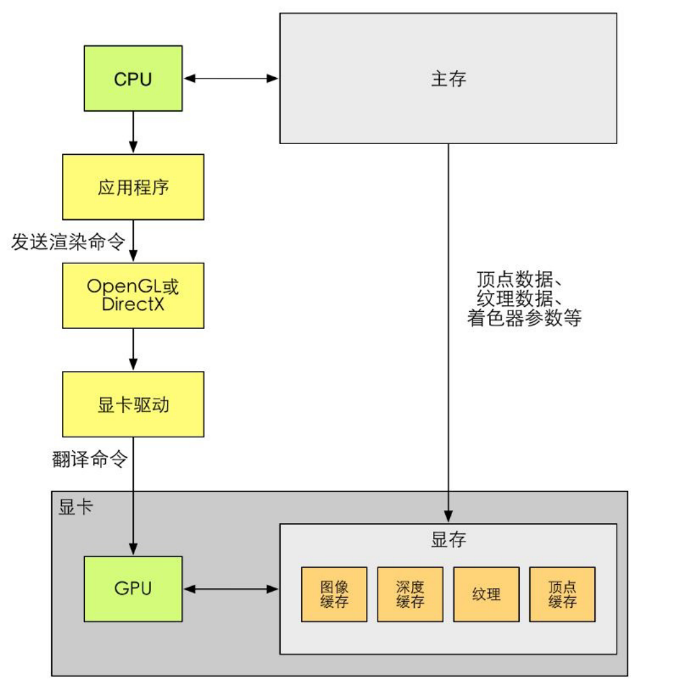
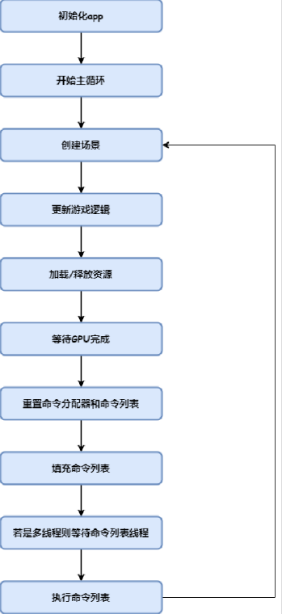
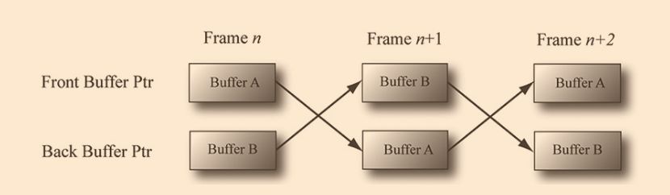

1. Triangles with d3d12
2. Camera
3. 3d mesh
4. Wave front model loading - G:\coding\_Graphics\tinyrenderer
    ifstream
    iss >> trash first
    then iss >> v.raw[0] >> v.raw[1] >> v.raw[2]
    Uniform vec[3];
    switch case

# https://www.cnblogs.com/chenglixue/p/17061919.html

# 
    Initialize

    Resource 

    Reset Command allocator Command list

    Fill Command List

    Execute Command List
## Com and Com Pointer
    1. 一种令DirectX不受编程语言限制，使之向后兼容的技术, 
    2. A kind of class, but can only be built with specific function instead of new()
    Releasing with Release() instead of delete
    3. COM对象会统计它自己的引用次数, 引用次数为0，会自行释放自己占用的内存
    4. WRL, 一种用于编写Windows Runtime API的C++模板库。这个库提供了一种类似COM（Component Object Model）的编程模式，使得开发者能够更方便地使用Windows Runtime API

## Device
表示：ID3D12Device
创建：D3D12CreateDevice()
使用DXGI factory来枚举GPU设备并找到一个最适合(满足功能级别需求)的GPU
## Resource
### Buffer Resources
    缓冲区类别(ID3D12Resource)
    Vertex Buffer(顶点缓冲区)
    Index Buffer(索引缓冲区)
    Constant Buffer(常量缓冲区)
### Texture Resources

## DXGI
管理DX的低级别任务
IDXGIFactory:主要用于创建IDXGISwapChain接口和枚举显示适配器
IDXGIAdapter:显示适配器
IDXGIOutput:显示输出
每种显示设备都有一系列它所支持的显示模式，以DXGI_MODE_DESC表示
确定显示模式的格式后，可以获得某显示输出对当前格式所支持的全部显示模式

## Swap Chain

IDXGISwapChainIDXGISwapChain (dxgi.h)：表示交换链。存储了前后台缓冲区两种纹理
IDXGISwapChain::ResizeBuffers (dxgi.h)：修改缓冲区大小
IDXGISwapChain::Present (dxgi.h) ：呈现缓冲区
SyncInterval:当前帧的最后一列更新时间和下一帧的第一列更新时间的时间差.DWM(桌面窗口管理器)的系统服务会在每个SI醒来，并获得在桌面上运行的所有图形应用程序的Swap Chain中最新完成的Back Buffer，将整个桌面的最终图像合成到它自己的后台缓冲区中，当它成为当前缓冲区时，它将在下一个SI显示在屏幕上

## Render Targets

https://www.cnblogs.com/chenglixue/p/17084161.html